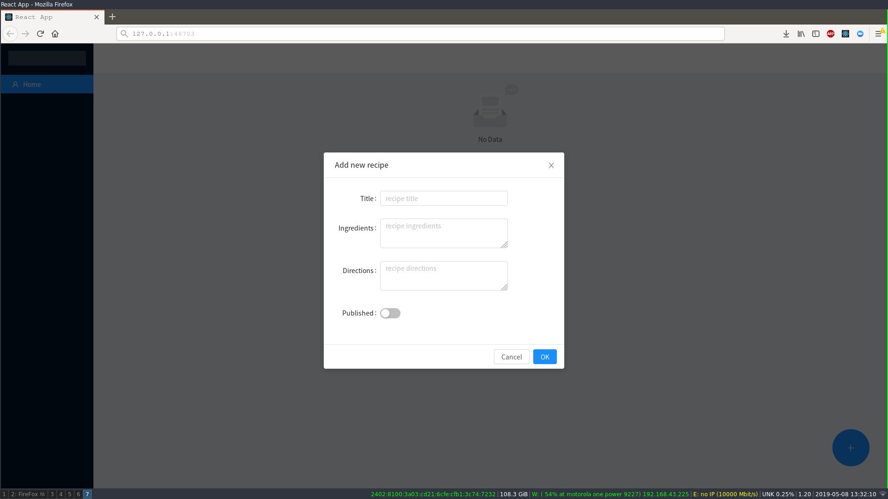

# RecipeCRUD
Recipe Application using React and Prisma. Made by following a scotch.io tutorial. 



## Installation and Set Up

Clone the repo from GitHub:

```
git clone https://github.com/PyAgni/RecipeCRUD.git/
```

Fetch from the develop branch:

```
git fetch origin develop
```

Install Prisma cli:

```
npm install -g prisma
```

Navigate to the root folder:

```
cd recipe-app-react-prisma
```

Install the required packages:

```
npm install
```

Navigate to the client folder:

```
cd client
```

Install the required packages:

```
npm install
```


## Launching the App

Start your local prisma server by running `docker-compose up -d` then navigate to the client folder and run `npm start`

## Built With...

- [Prisma](https://prisma.io/)
- [React](https://reactjs.org/)
- [Ant Design](https://ant.design/)
